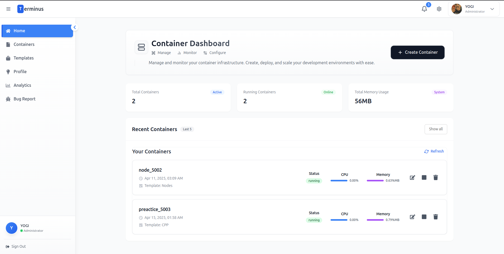
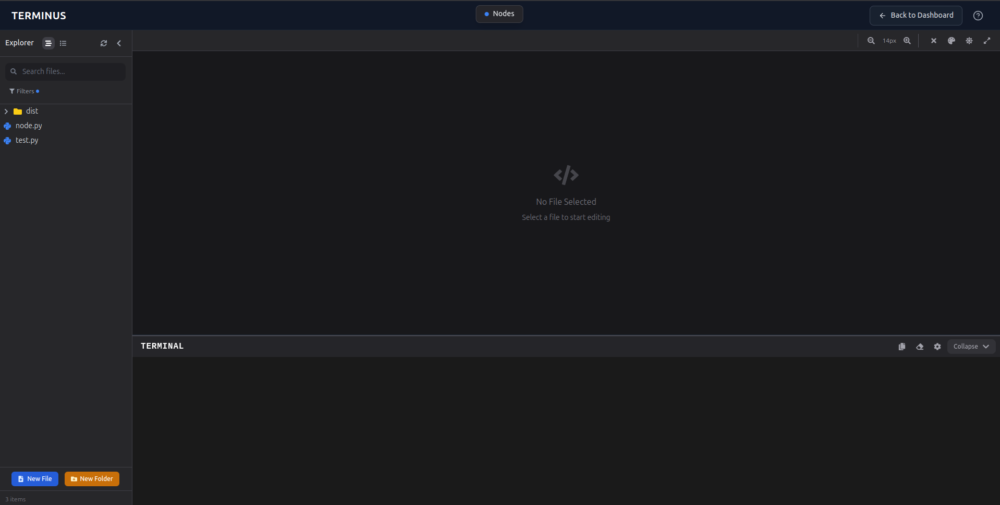

<p align="center">
  
</p>

<h1 align="center">🌐 Online IDE (Terminas)</h1>

<p align="center">
  <em>The next generation cloud development environment</em>
</p>


<hr style="border:1px solid #e5e7eb; width:80%; margin:24px auto;"/>

## ✨ <span style="color:#2563eb;">Features</span>
<div align="center">
<table>
  <tr>
    <td>📝<br><b>Online IDE</b><br><span style="font-size:0.95em;">Code in your browser with syntax highlighting, themes, and instant execution.</span></td>
    <td>🐳<br><b>Container Management</b><br><span style="font-size:0.95em;">Deploy, manage, and scale Docker-based containers effortlessly.</span></td>
    <td>🤝<br><b>Real-time Collaboration</b><br><span style="font-size:0.95em;">Work with teammates in real time.</span></td>
    <td>🔒<br><b>Advanced Security</b><br><span style="font-size:0.95em;">Enterprise-grade security for your code and containers.</span></td>
  </tr>
  <tr>
    <td>🛠️<br><b>Integrated Dev Tools</b><br><span style="font-size:0.95em;">Built-in terminal, analytics, and bug reporting.</span></td>
    <td>📚<br><b>Template Library</b><br><span style="font-size:0.95em;">Start projects from ready-made templates or your own images.</span></td>
    <td>🎨<br><b>Customizable Environment</b><br><span style="font-size:0.95em;">Themes, layouts, keyboard shortcuts.</span></td>
    <td>📊<br><b>Monitoring & Analytics</b><br><span style="font-size:0.95em;">Track resource usage, deployments, and performance.</span></td>
  </tr>
</table>
</div>

<hr style="border:1px solid #e5e7eb; width:80%; margin:24px auto;"/>

## 🖼️ <span style="color:#2563eb;">Screenshots</span>

<div align="center" style="display:flex; gap:2em;">
  
  
</div>

<hr style="border:1px solid #e5e7eb; width:80%; margin:24px auto;"/>

## 🚀 <span style="color:#2563eb;">Demo</span>

<div align="center" style="margin:32px 0;">
  <a href="http://157.245.101.60:4173/" target="_blank" style="display:inline-block; background:#2563eb; color:#fff; font-size:1.35rem; font-weight:bold; padding:1em 2.5em; border-radius:12px; text-decoration:none; box-shadow:0 2px 12px rgba(37,99,235,0.15);">
    🌐 Try the Live Demo &rarr;
  </a>
</div>

<hr style="border:1px solid #e5e7eb; width:80%; margin:24px auto;"/>

## 🛠️ <span style="color:#2563eb;">Tech Stack</span>

<ul>
  <li><b>Frontend:</b> React, Vite, Tailwind CSS, Chakra UI, MUI</li>
  <li><b>State Management:</b> Redux Toolkit</li>
  <li><b>Networking:</b> Axios, Socket.io-client</li>
  <li><b>Forms & Validation:</b> React Hook Form, Zod</li>
  <li><b>Notifications:</b> React Hot Toast, SweetAlert2</li>
  <li><b>Other:</b> Framer Motion, Radix UI, Xterm.js, and more</li>
</ul>

<hr style="border:1px solid #e5e7eb; width:80%; margin:24px auto;"/>

## 📁 <span style="color:#2563eb;">Folder Structure (Key)</span>

```
├── public/                # Static assets
├── src/
│   ├── assets/            # Images, icons, illustrations
│   ├── components/        # Reusable UI components
│   ├── newComp/           # Newer UI/feature components
│   ├── pages/             # Main page components (Home, Dashboard, Project, etc.)
│   ├── store/             # Redux slices and store setup
│   ├── utils/             # Utility functions
│   └── App.jsx            # Main app logic and routing
├── package.json           # Project metadata and dependencies
├── tailwind.config.js     # Tailwind CSS configuration
├── vite.config.js         # Vite configuration
└── README.md              # Project documentation
```

---

## 📝 Getting Started

### Prerequisites
- Node.js (v18+ recommended)
- npm or yarn

### Installation
```bash
# Clone the repository
git clone <repo-url>
cd Online_frontend

# Install dependencies
npm install

# Start the development server
npm run dev
```

The app will be available at [http://localhost:5173](http://localhost:5173) by default.

### Building for Production
```bash
npm run build
```

### Linting & Formatting
```bash
npm run lint
```

---

## 🤝 Contributing

Contributions are welcome! Please follow these steps:

1. Fork the repository
2. Create your feature branch (`git checkout -b feature/YourFeature`)
3. Commit your changes (`git commit -m 'Add some feature'`)
4. Push to the branch (`git push origin feature/YourFeature`)
5. Open a pull request

Please read the [contributing guidelines](CONTRIBUTING.md) for more details.

---

## ❓ FAQ

<details>
<summary>How do I report a bug?</summary>
<p>Use the in-app bug reporting tool or open an issue on GitHub.</p>
</details>

<details>
<summary>Can I use my own Docker images?</summary>
<p>Yes! You can start containers from your own images or use templates provided by Terminus.</p>
</details>

<details>
<summary>Is there a free tier?</summary>
<p>Yes, Terminus offers a free tier with limited resources. Contact us for enterprise plans.</p>
</details>

---

## 📚 Documentation & Help
- **User Guide**: Visit the in-app Documentation section for detailed usage instructions.
- **Contact**: Use the Contact Us page or email the team at <a href="mailto:cloudeide@development.in">cloudeide@development.in</a>

---

## 👨‍💻 Authors & Credits
- Himanshu Saraswat ([himanshu.s22@iiits.in](mailto:himanshu.s22@iiits.in)) – Full Stack Developer
- Adarsh Singh ([adarsh.s22@iiits.in](mailto:adarsh.s22@iiits.in)) – Full Stack Developer

Special thanks to the open-source community and all contributors.

---

## 📝 License

This project is licensed under the MIT License - see the [LICENSE](LICENSE) file for details.

---

<p align="center">
  <i>© 2025 Terminus – Cloud IDE & Container Management Platform</i>
</p>

### Installation
```bash
# Clone the repository
$ git clone <repo-url>
$ cd Online_frontend

# Install dependencies
$ npm install

# Start the development server
$ npm run dev
```

The app will be available at [http://localhost:5173](http://localhost:5173) by default.

### Building for Production
```bash
npm run build
```

### Linting & Formatting
```bash
npm run lint
```

## 📚 Documentation & Help
- **User Guide**: Visit the in-app Documentation section for detailed usage instructions.
- **Contact**: Use the Contact Us page or email the team at cloudeide@development.in

## 👨‍💻 Authors & Credits
- Himanshu Saraswat ([himanshu.s22@iiits.in](mailto:himanshu.s22@iiits.in)) – Full Stack Developer
- Adarsh Singh ([adarsh.s22@iiits.in](mailto:adarsh.s22@iiits.in)) – Full Stack Developer

Special thanks to the open-source community and all contributors.

---

> © 2025 Terminus – Cloud IDE & Container Management Platform
